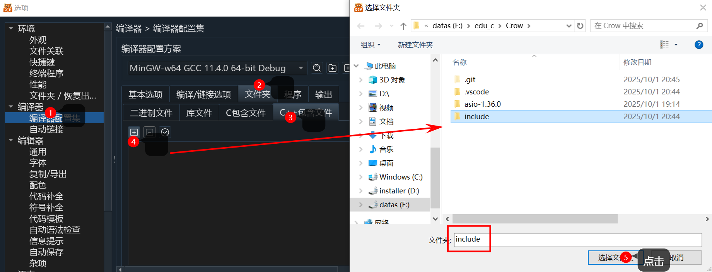
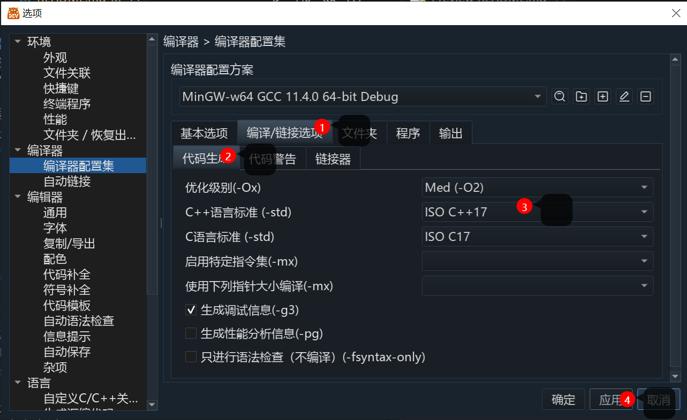
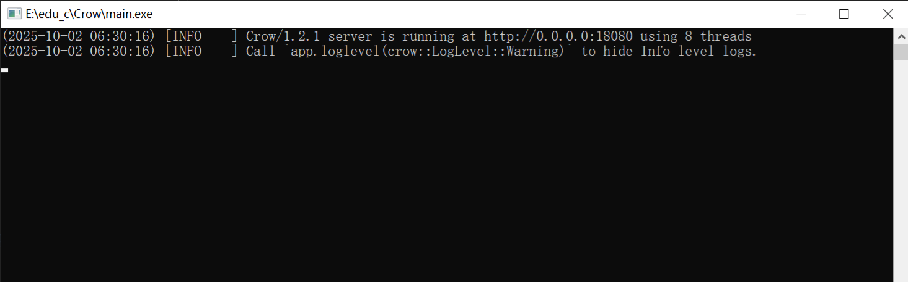

# sample-cppCrow

这是一个基于 [Crow](https://github.com/CrowCpp/Crow) 的 **C++ Web 框架示例集合**, 克隆即可使用，已经包含了所需库，无需额外引入`Crow`。

每个示例都放在 `samples/` 目录下，独立成一个小项目，包含入口、路由、静态网页，方便初学者快速上手。

## 运行环境

1. 目前只测试过`MinGW g++`
2. 支持C++ 14及以上的编译器，更推荐 C++17，
3. 目前只测试过操作系统: windows10

## 📂 项目结构
```bash
sample-cppCrow/ 
├─ include/ # Crow 头文件 
├─ third_party/asio/include/ # Asio 头文件 
├─ samples/
│ ├─ hello_world/ # 示例 1：最简单的 Hello World 
│ │ ├─ main.cpp 
│ │ ├─ routes.h 
│ │ ├─ routes.cpp 
│ │ └─ static/index.html 
│ ├─ json_api/ # 示例 2：返回 JSON API 
│ │ ├─ main.cpp 
│ │ ├─ routes.h 
│ │ ├─ routes.cpp 
│ │ └─ static/index.html 
│ └─ ... 
└─ .vscode/ # VSCode 配置（tasks.json）
```
# 编辑器设置

## 小熊猫DevC++

1. 打开小熊猫 -> 点击顶部`工具->选项`

2. 编译器设置
    1. 选项窗口左侧找到`编译器配置集`
    2. **添加c++包含文件**
        右侧找到`文件夹`->点击`C++包含文件`->点击加号图标->把文件夹`include`路径添加进去,点击应用。

        
    
    3. **设置C++语言标准**
        右侧找到`编译/链接选项`->找到`C++语言标准(-std)`改成`ISO C++17`

        
3. **添加编译链接指令**
    ```bash
    -lws2_32 -lmswsock -lpthread
    ```
    1. 选项窗口左侧找到`自动链接`-> 点击加号图标，填入如下内容后, 点击应用
    
        | 头文件 | UTF-8 | 链接参数 |
        | --- | ---  | --- |
        | crow.h | | -lws2_32 -lmswsock -lpthread

    
## vscode

可以直接使用`.vscode/tasks.json`中已经配置好编译运行命令。

# ⚙️ 编译与运行

**配置完编辑器后**就可以运行`main.cpp`看看效果了。

*更多的示例在`samples`文件夹中。*

当示例代码运行后，你将会在控制台看到👇, [点击此链接](http://127.0.0.1:18080)跳转到你的网页。



## 方法一：使用小熊猫

打开目录中的`main.cpp`，直接编译运行即可。


## 方法二：使用 VSCode
1. 打开本项目文件夹。  
2. 按 `Ctrl+Shift+B`，选择 **Build Sample**。  
3. 选择要运行的示例（如 `hello_world`）。  
4. 编译完成后，选择 **Run Sample**，程序会自动启动。  
5. 打开浏览器访问：
   - `http://127.0.0.1:18080/` → 静态网页  
   - `http://127.0.0.1:18080/api/hello` → JSON API  